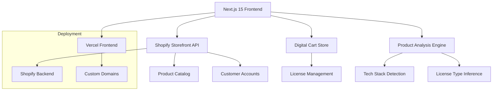

# 🚀 Afilo - Digital Software Marketplace

[](https://nextjs.org/)
[](https://www.typescriptlang.org/)
[](https://tailwindcss.com/)
[](https://shopify.dev/docs/storefront-api)
[](https://vercel.com)
[](LICENSE)
[](https://github.com/code-craka/afilo-nextjs-shopify-app/actions)
[](https://eslint.org/)
[](https://app.afilo.io)

> **A cutting-edge headless e-commerce platform specializing in digital software products** - Built with Next.js 15, TypeScript, and Shopify Storefront API

**Author:** [Rihan](https://github.com/code-craka)  
**Live Demo:** [app.afilo.io](https://app.afilo.io)  
**Customer Portal:** [account.afilo.io](https://account.afilo.io)

## 📋 Table of Contents

- [🌟 Features](#-features)
- [🏗️ Architecture](#️-architecture)
- [🚀 Quick Start](#-quick-start)
- [💻 Tech Stack](#-tech-stack)
- [📁 Project Structure](#-project-structure)
- [🔧 Configuration](#-configuration)
- [🛠️ Development](#️-development)
- [🧪 Testing](#-testing)
- [🚀 Deployment](#-deployment)
- [📖 API Documentation](#-api-documentation)
- [🤝 Contributing](#-contributing)
- [📄 License](#-license)
- [👤 Author](#-author)

## 🌟 Features

### 💎 Digital Commerce Specialization
- **🎯 Software Product Focus**: Optimized for AI tools, templates, scripts, and plugins
- **🏷️ Smart Product Analysis**: Automatic tech stack detection and categorization
- **📜 License Management**: Support for Personal, Commercial, Extended, and Enterprise licenses
- **⚡ Instant Delivery**: Digital download system with immediate access
- **🎓 Educational Discounts**: 50% student discounts on eligible products

### 🛒 Enhanced Shopping Experience
- **🔍 Intelligent Product Grid**: Advanced filtering and search capabilities
- **💼 Digital Cart**: Specialized cart system for software products
- **👥 Team Licensing**: Bulk licensing with team size management
- **🌍 Global Support**: Multi-currency and regional tax calculation
- **📱 Responsive Design**: Mobile-first, accessible interface

### 🔧 Developer Experience
- **⚡ Performance Optimized**: Core Web Vitals compliant
- **🔒 Type Safety**: Full TypeScript strict mode
- **🎨 Modern Styling**: Tailwind CSS v4 with zero config
- **🧩 Component Library**: ShadCN/UI with custom e-commerce patterns
- **🔄 State Management**: Zustand for efficient state handling

## 🏗️ Architecture



### Core Components

- **Frontend**: Next.js 15 with App Router for optimal performance
- **Backend**: Shopify Storefront API for commerce functionality  
- **State**: Zustand for cart and license management
- **UI**: ShadCN/UI components with custom digital commerce patterns
- **Styling**: Tailwind CSS v4 for modern, responsive design
- **Deployment**: Vercel for frontend, Shopify for backend services

## 🚀 Quick Start

### Prerequisites

- **Node.js**: 18.17+ or 20.3+ (LTS recommended)
- **pnpm**: 8.0+ (required - do not use npm or yarn)
- **Git**: Latest version
- **Shopify Store**: Access to Shopify Storefront API

### Installation

1. **Clone the repository**
   ```bash
   git clone https://github.com/code-craka/afilo-nextjs-shopify-app.git
   cd afilo-nextjs-shopify-app
   ```

2. **Install dependencies**
   ```bash
   pnpm install
   ```

3. **Environment setup**
   ```bash
   cp .env.example .env.local
   # Edit .env.local with your Shopify credentials
   ```

4. **Start development server**
   ```bash
   pnpm dev --turbopack
   ```

5. **Open your browser**
   Navigate to <http://localhost:3000>

## 💻 Tech Stack

### Frontend
- **Framework**: Next.js 15.5.4 (App Router, React 19)
- **Language**: TypeScript 5.6 (Strict Mode)
- **Styling**: Tailwind CSS v4 (Zero Config)
- **Components**: ShadCN/UI with custom e-commerce patterns
- **Icons**: Lucide React icons
- **Fonts**: Inter (Google Fonts)

### Backend & APIs
- **E-commerce**: Shopify Storefront API v2024.07
- **GraphQL**: Advanced fragment optimization
- **Authentication**: Shopify Customer Accounts API
- **State Management**: Zustand stores

### Development & Tooling
- **Package Manager**: pnpm (required)
- **Build Tool**: Turbopack (Next.js native)
- **Code Quality**: ESLint, Prettier, TypeScript strict
- **AI Integration**: Claude AI with MCP servers
- **Version Control**: Git with conventional commits

### Deployment & Infrastructure
- **Frontend**: Vercel (app.afilo.io)
- **Customer Portal**: Vercel (account.afilo.io)
- **Backend**: Shopify (fzjdsw-ma.myshopify.com)
- **CDN**: Vercel Edge Network + Shopify CDN

## 📁 Project Structure

```
afilo-nextjs-shopify-app/
├── 📁 app/                     # Next.js App Router
│   ├── 📄 globals.css         # Global styles (Tailwind imports)
│   ├── 📄 layout.tsx          # Root layout with cart integration
│   ├── 📄 page.tsx            # Homepage with featured products
│   ├── 📁 products/           # Product catalog pages
│   └── 📁 test-shopify/       # API testing & debugging
├── 📁 components/             # React components
│   ├── 📄 ProductGrid.tsx     # Enhanced digital product display
│   ├── 📄 DigitalCartWidget.tsx # Cart UI with license management
│   └── 📁 ui/                 # ShadCN/UI components
├── 📁 lib/                    # Core utilities
│   ├── 📄 shopify.ts          # Shopify API client & GraphQL
│   └── 📄 utils.ts            # Utility functions
├── 📁 store/                  # State management
│   └── 📄 digitalCart.ts      # Cart & license state (Zustand)
├── 📁 hooks/                  # Custom React hooks
│   └── 📄 useDigitalCart.ts   # Cart operations hook
├── 📁 types/                  # TypeScript definitions
│   └── 📄 shopify.ts          # Shopify API types
├── 📁 docs/                   # Documentation
├── 📁 .github/                # GitHub workflows & templates
│   ├── 📁 workflows/          # CI/CD pipelines
│   └── 📄 copilot-instructions.md # AI agent guidelines
└── 📁 .claude/                # Claude AI configuration
```

## 🔧 Configuration

### Environment Variables

Create a `.env.local` file in the root directory:

```env
# Shopify Configuration (Required)
NEXT_PUBLIC_SHOPIFY_STORE_DOMAIN=fzjdsw-ma.myshopify.com
NEXT_PUBLIC_SHOPIFY_STOREFRONT_ACCESS_TOKEN=your_storefront_token

# Customer Accounts (Optional)
NEXT_PUBLIC_CUSTOMER_ACCOUNT_CLIENT_ID=your_client_id

# Development (Optional)
NEXT_PUBLIC_VERCEL_URL=your_preview_url
ANALYZE=true  # Bundle analyzer
```

### Package.json Scripts

```json
{
  "scripts": {
    "dev": "next dev --turbopack",           # Development with Turbopack
    "build": "next build",                   # Production build
    "start": "next start",                   # Production server
    "lint": "next lint",                     # ESLint checking
    "lint:fix": "next lint --fix",           # Auto-fix linting issues
    "type-check": "tsc --noEmit",            # TypeScript checking
    "analyze": "ANALYZE=true next build"     # Bundle analysis
  }
}
```

### Shopify Store Configuration

1. **Enable Storefront API**: Go to Apps → Private Apps → Create Private App
2. **Set Permissions**: Enable Storefront API with read access to products, collections, customers
3. **Get Token**: Copy the Storefront Access Token
4. **Configure Store**: Set up digital product structure with proper tags and metadata

## 🛠️ Development

### Development Workflow

1. **Start MCP Context7 Server** (mandatory first step):
   ```bash
   /mcp context7
   ```

2. **Start Development Server**:
   ```bash
   pnpm dev --turbopack
   ```

3. **Open Development Tools**:
   - Main app: <http://localhost:3000>
   - API testing: <http://localhost:3000/test-shopify>
   - Product catalog: <http://localhost:3000/products>

### Code Quality Standards

- **TypeScript**: Strict mode required
- **ESLint**: Next.js configuration with custom rules
- **Prettier**: Automatic code formatting
- **Commit Conventions**: Conventional commits required

### API Integration Patterns

```typescript
// Example: Using Shopify API
import { getProducts, ShopifyProduct } from '@/lib/shopify';

const ProductPage = async () => {
  const products: ShopifyProduct[] = await getProducts({
    first: 20,
    query: 'tag:software'
  });

  return <ProductGrid products={products} />;
};
```

### Digital Commerce Features

- **Tech Stack Detection**: Automatic analysis from product titles/descriptions
- **License Management**: Dynamic pricing based on license type
- **Educational Discounts**: 50% student pricing
- **Team Licensing**: Bulk pricing for organizations

## 🧪 Testing

### Manual Testing

1. **API Connectivity**:
   ```bash
   pnpm dev --turbopack
   # Visit http://localhost:3000/test-shopify
   ```

2. **Product Display**:
   - Test ProductGrid rendering
   - Verify tech stack detection
   - Check license type inference

3. **Cart Functionality**:
   - Add products to cart
   - Change license types
   - Verify pricing calculations

### Debug Tools

- **Console Logging**: Comprehensive development logs
- **GraphQL Explorer**: Built-in query testing
- **Error Boundaries**: Graceful error handling
- **Performance Monitoring**: Core Web Vitals tracking

## 🚀 Deployment

### Vercel Deployment (Recommended)

1. **Connect Repository**:
   ```bash
   # Push to GitHub first
   git add .
   git commit -m "feat: ready for deployment"
   git push origin main
   ```

2. **Deploy on Vercel**:
   - Import project from GitHub
   - Add environment variables
   - Deploy with automatic CI/CD

3. **Custom Domains**:
   - Frontend: `app.afilo.io`
   - Customer Portal: `account.afilo.io`

### Environment Setup

```yaml
# vercel.json
{
  "framework": "nextjs",
  "buildCommand": "pnpm build",
  "devCommand": "pnpm dev --turbopack",
  "installCommand": "pnpm install",
  "env": {
    "NEXT_PUBLIC_SHOPIFY_STORE_DOMAIN": "@shopify-domain",
    "NEXT_PUBLIC_SHOPIFY_STOREFRONT_ACCESS_TOKEN": "@shopify-token"
  }
}
```

### Performance Targets

- **LCP**: < 2.5s (Largest Contentful Paint)
- **FID**: < 100ms (First Input Delay)  
- **CLS**: < 0.1 (Cumulative Layout Shift)
- **Bundle Size**: < 250KB gzipped main bundle

## 📖 API Documentation

### Shopify Integration

```typescript
// Core API Functions
export async function getProducts(params: ProductsQueryParams): Promise<ShopifyProduct[]>
export async function getProduct(handle: string): Promise<ShopifyProduct | null>
export async function getCollections(): Promise<ShopifyCollection[]>
```

### Digital Cart API

```typescript
// Cart Operations
const { 
  cart, 
  addToCart, 
  removeFromCart, 
  changeLicense,
  calculateTotal 
} = useDigitalCart();
```

### GraphQL Fragments

The application uses optimized GraphQL fragments for efficient data fetching:

```graphql
fragment ProductFragment on Product {
  id
  handle
  title
  description
  # ... additional fields
}
```

## 🤝 Contributing

### Getting Started

1. **Fork the Repository**
2. **Create Feature Branch**:
   ```bash
   git checkout -b feature/amazing-feature
   ```
3. **Make Changes**: Follow coding standards
4. **Commit Changes**:
   ```bash
   git commit -m "feat: add amazing feature"
   ```
5. **Push Branch**:
   ```bash
   git push origin feature/amazing-feature
   ```
6. **Open Pull Request**

### Development Guidelines

- Use `pnpm` exclusively (never npm/yarn)
- Run `/mcp context7` before any file operations
- Follow TypeScript strict mode
- Write meaningful commit messages
- Test changes thoroughly

### Code Review Process

- All changes require review
- Automated CI/CD checks must pass
- Performance impact assessment
- Security review for API changes

## 📄 License

This project is licensed under the MIT License. See the [LICENSE](LICENSE) file for details.

```
MIT License

Copyright (c) 2025 Rihan

Permission is hereby granted, free of charge, to any person obtaining a copy
of this software and associated documentation files (the "Software"), to deal
in the Software without restriction, including without limitation the rights
to use, copy, modify, merge, publish, distribute, sublicense, and/or sell
copies of the Software, and to permit persons to whom the Software is
furnished to do so, subject to the following conditions:

The above copyright notice and this permission notice shall be included in all
copies or substantial portions of the Software.
```

## 👤 Author

**Rihan**
- GitHub: [@code-craka](https://github.com/code-craka)
- Project: [Afilo Digital Marketplace](https://app.afilo.io)
- Repository: [afilo-nextjs-shopify-app](https://github.com/code-craka/afilo-nextjs-shopify-app)

---

<div align="center">

**Built with ❤️ by Rihan** | **Powered by Next.js & Shopify** | **Deployed on Vercel**

[🚀 Live Demo](https://app.afilo.io) • [📚 Documentation](./docs/) • [🐛 Report Bug](https://github.com/code-craka/afilo-nextjs-shopify-app/issues) • [💡 Request Feature](https://github.com/code-craka/afilo-nextjs-shopify-app/issues)

</div>

## 🚀 Features

### Digital Commerce Optimized
- **Smart Product Showcase** - Automatically detects tech stack and product types
- **License Management** - Clear license type indicators (Personal, Commercial, Extended)
- **Instant Downloads** - Digital delivery with instant access
- **Developer-Focused Design** - Professional B2B software presentation

### Enhanced ProductGrid
- **Tech Stack Badges** - Auto-detects React, Python, AI, TypeScript, etc.
- **Product Type Indicators** - AI Tool, Template, Script, Plugin badges
- **Version Numbering** - Displays version information
- **Documentation Badges** - Shows when docs are included
- **Live Demo Buttons** - Preview functionality for applicable products

### Modern Stack
- **Next.js 15.5.4** with App Router
- **TypeScript** strict mode
- **Tailwind CSS v4** (no config needed)
- **ShadCN UI** components
- **Framer Motion** animations
- **Shopify Storefront API** integration

## 🛠 Tech Stack

- **Frontend**: Next.js 15.5.4, TypeScript, Tailwind CSS v4, ShadCN UI
- **Backend**: Shopify Storefront API, Customer Account API
- **Animations**: Framer Motion
- **State Management**: Zustand + React Query (planned)
- **Deployment**: Vercel (frontend), Shopify (backend)
- **Domain**: app.afilo.io

## 🚀 Getting Started

### Prerequisites
- Node.js 18+
- pnpm (recommended package manager)
- Shopify store with Storefront API access

### Installation

1. **Clone the repository**
   ```bash
   git clone <repository-url>
   cd afilo-nextjs-shopify-app
   ```

2. **Install dependencies**
   ```bash
   pnpm install
   ```

3. **Configure environment variables**
   ```bash
   cp .env.local.example .env.local
   ```

   Update `.env.local` with your Shopify credentials:
   ```env
   NEXT_PUBLIC_SHOPIFY_STORE_DOMAIN=your-store.myshopify.com
   NEXT_PUBLIC_SHOPIFY_STOREFRONT_ACCESS_TOKEN=your-storefront-token
   NEXT_PUBLIC_CUSTOMER_ACCOUNT_CLIENT_ID=your-client-id
   ```

4. **Run development server**
   ```bash
   pnpm dev
   ```

5. **Open your browser**
   Navigate to [http://localhost:3000](http://localhost:3000)

## 📁 Project Structure

```
afilo-nextjs-shopify-app/
├── app/                     # Next.js App Router
│   ├── page.tsx            # Homepage with featured products
│   ├── products/           # Product catalog
│   └── test-shopify/       # API testing interface
├── components/
│   ├── ProductGrid.tsx     # Enhanced digital commerce grid
│   └── ui/                 # ShadCN UI components
├── lib/
│   ├── shopify.ts         # Shopify API client
│   └── utils.ts           # Utility functions
├── types/
│   └── shopify.ts         # TypeScript interfaces
└── .claude/               # Claude Code configuration
```

## 🎯 Available Pages

- **`/`** - Homepage with featured products showcase
- **`/products`** - Full product catalog with search and sort
- **`/test-shopify`** - API testing and debugging interface

## 🔧 Development

### Package Manager
This project uses **pnpm** as the package manager. Key commands:

```bash
pnpm dev          # Start development server
pnpm build        # Build for production
pnpm start        # Start production server
pnpm lint         # Run linting
```

### Development Guidelines

1. **TypeScript Strict Mode** - All code must pass strict type checking
2. **Component Structure** - Follow the established patterns in `components/`
3. **Error Handling** - Comprehensive error states and retry logic
4. **Accessibility** - WCAG 2.1 AA compliance required
5. **Performance** - Core Web Vitals optimization

### Code Review Process

- Use `@shopify-code-review` for Shopify-specific reviews
- Use `@nextjs-design-review` for UI/UX changes
- Run `/security-review` for e-commerce related changes

## 🏗 Architecture

### Shopify Integration
- **Storefront API** - Product catalog, collections, cart management
- **Customer Account API** - Authentication and user management
- **Webhooks** - Real-time updates (planned)

### Digital Product Features
- **Smart Detection** - Automatically identifies product types and tech stacks
- **License Management** - Supports multiple license types
- **Instant Delivery** - Optimized for digital goods

### Performance Optimizations
- **Core Web Vitals**: LCP < 2.5s, FID < 100ms, CLS < 0.1
- **Bundle Size**: Main bundle < 250KB gzipped
- **API Response**: < 200ms for Shopify API calls

## 🧪 Testing

### API Testing
Visit `/test-shopify` to:
- Test Shopify API connectivity
- Debug product data structure
- Verify environment configuration

### Debug Features
- Development-only debug information
- Comprehensive console logging
- Error state visualization
- Loading state indicators

## 🚀 Deployment

### Vercel Deployment
1. Connect your GitHub repository to Vercel
2. Configure environment variables in Vercel dashboard
3. Deploy with automatic builds on push

### Environment Variables
Required for production:
```env
NEXT_PUBLIC_SHOPIFY_STORE_DOMAIN=your-store.myshopify.com
NEXT_PUBLIC_SHOPIFY_STOREFRONT_ACCESS_TOKEN=your-token
NEXT_PUBLIC_CUSTOMER_ACCOUNT_CLIENT_ID=your-client-id
NEXT_PUBLIC_SITE_URL=https://app.afilo.io
```

## 📝 Contributing

1. Follow the established TypeScript and component patterns
2. Ensure all new features include proper error handling
3. Test with both development and production builds
4. Use the provided Claude Code agents for reviews

## 🔒 Security

- Shopify Storefront API provides secure product access
- No sensitive data exposed in frontend code
- Environment variables properly configured
- Digital rights protection through license management

## 📚 Learn More

- [Next.js Documentation](https://nextjs.org/docs)
- [Shopify Storefront API](https://shopify.dev/docs/api/storefront)
- [Tailwind CSS v4](https://tailwindcss.com/docs)
- [ShadCN UI](https://ui.shadcn.com/)

## 🤝 Support

For questions or issues:
1. Check the `/test-shopify` page for API connectivity
2. Review console logs for detailed error information
3. Use Claude Code agents for development assistance

---

**Built for digital commerce success** 🚀