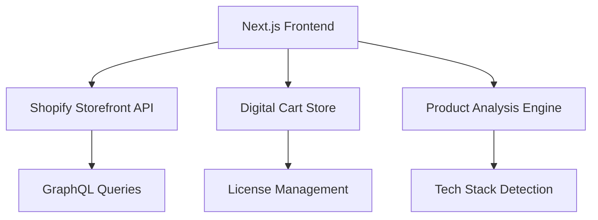

# 📖 API Documentation

**Project**: Afilo Digital Marketplace  
**Author**: Rihan (@code-craka)  
**Repository**: [afilo-nextjs-shopify-app](https://github.com/code-craka/afilo-nextjs-shopify-app)  
**Live Demo**: [app.afilo.io](https://app.afilo.io)  

## 🏗️ Architecture Overview

Afilo Digital Marketplace uses a headless commerce architecture with Next.js frontend and Shopify backend, specialized for digital software products.

### Core Components



## 🛒 Shopify Integration API

### Core Functions

```typescript
// lib/shopify.ts - Main API client
export async function getProducts(params: ProductsQueryParams): Promise<ShopifyProduct[]>
export async function getProduct(handle: string): Promise<ShopifyProduct | null>
export async function getProductById(id: string): Promise<ShopifyProduct | null>
export async function getCollections(): Promise<ShopifyCollection[]>
export async function getCollection(handle: string): Promise<ShopifyCollection | null>
```

### Product Query Parameters

```typescript
interface ProductsQueryParams {
  first?: number;           // Number of products (default: 20)
  last?: number;            // Last N products  
  after?: string;           // Pagination cursor
  before?: string;          // Pagination cursor
  query?: string;           // Search query
  sortKey?: ProductSortKeys; // Sort criteria
  reverse?: boolean;        // Reverse order
}
```

### Usage Examples

```typescript
// Get featured products
const featuredProducts = await getProducts({
  first: 12,
  query: 'tag:featured'
});

// Get AI tools
const aiTools = await getProducts({
  first: 20,
  query: 'product_type:"AI Tool"'
});

// Get specific product
const product = await getProduct('ai-productivity-suite');
```

## 🎯 Product Analysis Engine

### Tech Stack Detection

The ProductGrid automatically analyzes products to detect technology stacks:

```typescript
// components/ProductGrid.tsx
function detectTechStack(product: ShopifyProduct): string[] {
  const text = `${product.title} ${product.description}`.toLowerCase();
  const stacks = [];
  
  // Framework detection
  if (/react|next\.?js/i.test(text)) stacks.push('React');
  if (/vue\.?js/i.test(text)) stacks.push('Vue.js');
  if (/angular/i.test(text)) stacks.push('Angular');
  
  // Language detection  
  if (/python|django|flask/i.test(text)) stacks.push('Python');
  if (/javascript|js|node\.?js/i.test(text)) stacks.push('JavaScript');
  if (/typescript|ts/i.test(text)) stacks.push('TypeScript');
  
  return stacks;
}
```

### License Type Inference

```typescript
function inferLicenseType(product: ShopifyProduct): LicenseType {
  const price = parseFloat(product.priceRange.minVariantPrice.amount);
  const title = product.title.toLowerCase();
  
  if (price === 0) return 'Free';
  if (price < 50) return 'Personal';
  if (price < 200) return 'Commercial';
  if (price < 500) return 'Extended';
  return 'Enterprise';
}
```

## 🛒 Digital Cart API

### Cart State Management

```typescript
// store/digitalCart.ts - Zustand store
interface CartState {
  items: CartItem[];
  isOpen: boolean;
  addItem: (product: ShopifyProduct, license: LicenseType) => void;
  removeItem: (productId: string) => void;
  updateQuantity: (productId: string, quantity: number) => void;
  changeLicense: (productId: string, license: LicenseType) => void;
  calculateTotal: () => number;
  clear: () => void;
}
```

### Cart Operations Hook

```typescript
// hooks/useDigitalCart.ts
export function useDigitalCart() {
  const cart = useDigitalCartStore();
  
  const addToCart = (product: ShopifyProduct, license: LicenseType = 'Personal') => {
    const techStack = detectTechStack(product);
    const inferredLicense = inferLicenseType(product);
    
    cart.addItem(product, license || inferredLicense);
    
    // Analytics tracking
    trackEvent('add_to_cart', {
      product_id: product.id,
      product_name: product.title,
      license_type: license,
      tech_stack: techStack
    });
  };
  
  return { cart, addToCart, ...cart };
}
```

## 💎 License Management

### License Types

```typescript
type LicenseType = 
  | 'Free'        // $0 - Open source projects
  | 'Personal'    // < $50 - Individual use
  | 'Commercial'  // $50-199 - Small business
  | 'Extended'    // $200-499 - Agency/resale
  | 'Enterprise'  // $500+ - Large organization
  | 'Developer';  // Variable - Development teams
```

### Pricing Multipliers

```typescript
const LICENSE_MULTIPLIERS: Record<LicenseType, number> = {
  'Free': 0,
  'Personal': 1,
  'Commercial': 2.5,
  'Extended': 5,
  'Enterprise': 10,
  'Developer': 3
};

function calculateLicensePrice(basePrice: number, license: LicenseType): number {
  return basePrice * LICENSE_MULTIPLIERS[license];
}
```

### Educational Discounts

```typescript
function applyEducationalDiscount(price: number, isStudent: boolean): number {
  return isStudent ? price * 0.5 : price; // 50% student discount
}
```

## 🔍 GraphQL Queries

### Product Fragment

```graphql
fragment ProductFragment on Product {
  id
  handle
  title
  description
  descriptionHtml
  availableForSale
  createdAt
  updatedAt
  publishedAt
  vendor
  productType
  tags
  images(first: 10) {
    edges {
      node {
        ...ImageFragment
      }
    }
  }
  variants(first: 250) {
    edges {
      node {
        ...ProductVariantFragment
      }
    }
  }
  priceRange {
    minVariantPrice {
      ...MoneyFragment
    }
    maxVariantPrice {
      ...MoneyFragment
    }
  }
  featuredImage {
    ...ImageFragment
  }
  seo {
    title
    description
  }
}
```

### Query Examples

```graphql
# Get products with pagination
query GetProducts($first: Int, $after: String, $query: String) {
  products(first: $first, after: $after, query: $query) {
    edges {
      node {
        ...ProductFragment
      }
      cursor
    }
    pageInfo {
      hasNextPage
      hasPreviousPage
      startCursor
      endCursor
    }
  }
}
```

## 🚀 Performance Optimization

### Caching Strategy

```typescript
// Shopify API caching
const CACHE_DURATION = 60 * 5; // 5 minutes

export async function getCachedProducts(params: ProductsQueryParams) {
  const cacheKey = `products-${JSON.stringify(params)}`;
  const cached = cache.get(cacheKey);
  
  if (cached) return cached;
  
  const products = await getProducts(params);
  cache.set(cacheKey, products, CACHE_DURATION);
  
  return products;
}
```

### Bundle Optimization

```typescript
// Dynamic imports for large components
const ProductGrid = dynamic(() => import('@/components/ProductGrid'), {
  loading: () => <ProductGridSkeleton />,
  ssr: true
});
```

## 🧪 Testing API

### Debug Endpoints

Visit `/test-shopify` in development for API testing:

```typescript
// app/test-shopify/page.tsx
export default async function TestShopify() {
  const products = await getProducts({ first: 5 });
  const collections = await getCollections();
  
  return (
    <div>
      <h1>API Test Results</h1>
      <ProductDebugInfo products={products} />
      <CollectionDebugInfo collections={collections} />
    </div>
  );
}
```

### Error Handling

```typescript
// lib/shopify.ts - Error handling
class ShopifyAPIError extends Error {
  constructor(
    message: string,
    public type: 'NETWORK' | 'GRAPHQL' | 'VALIDATION',
    public retryable: boolean = false,
    public graphqlErrors?: any[]
  ) {
    super(message);
    this.name = 'ShopifyAPIError';
  }
}

// Usage with retry logic
async function shopifyFetchWithRetry<T>(query: string, variables: any, retries = 3): Promise<T> {
  for (let i = 0; i < retries; i++) {
    try {
      return await shopifyFetch<T>(query, variables);
    } catch (error) {
      if (error instanceof ShopifyAPIError && error.retryable && i < retries - 1) {
        await new Promise(resolve => setTimeout(resolve, Math.pow(2, i) * 1000));
        continue;
      }
      throw error;
    }
  }
  throw new Error('Max retries reached');
}
```

## 🔐 Authentication & Security

### API Token Security

```typescript
// Environment variables for security
const SHOPIFY_DOMAIN = process.env.NEXT_PUBLIC_SHOPIFY_STORE_DOMAIN;
const STOREFRONT_TOKEN = process.env.NEXT_PUBLIC_SHOPIFY_STOREFRONT_ACCESS_TOKEN;

// Token validation
if (!SHOPIFY_DOMAIN || !STOREFRONT_TOKEN) {
  throw new Error('Missing required Shopify credentials');
}
```

### Rate Limiting

```typescript
// Built-in rate limiting
const rateLimiter = new Map();

function checkRateLimit(key: string, limit: number, window: number): boolean {
  const now = Date.now();
  const requests = rateLimiter.get(key) || [];
  
  // Remove expired requests
  const validRequests = requests.filter((time: number) => now - time < window);
  
  if (validRequests.length >= limit) {
    return false;
  }
  
  validRequests.push(now);
  rateLimiter.set(key, validRequests);
  return true;
}
```

## 📊 Analytics Integration

### Event Tracking

```typescript
// Analytics events
interface AnalyticsEvent {
  event: string;
  product_id?: string;
  product_name?: string;
  license_type?: LicenseType;
  tech_stack?: string[];
  value?: number;
}

function trackEvent(event: string, data: Omit<AnalyticsEvent, 'event'>) {
  if (typeof window !== 'undefined' && window.gtag) {
    window.gtag('event', event, data);
  }
}
```

## 🛠️ Development Tools

### Debug Utilities

```typescript
// Development-only debugging
if (process.env.NODE_ENV === 'development') {
  // Enable GraphQL query logging
  console.log('GraphQL Query:', query);
  console.log('Variables:', variables);
  console.log('Response:', result);
}
```

### Type Generation

```bash
# Generate TypeScript types from Shopify schema
npm run codegen
```

---

**API Documentation maintained with ❤️ by Rihan**  
**For questions or issues, visit**: [GitHub Issues](https://github.com/code-craka/afilo-nextjs-shopify-app/issues)